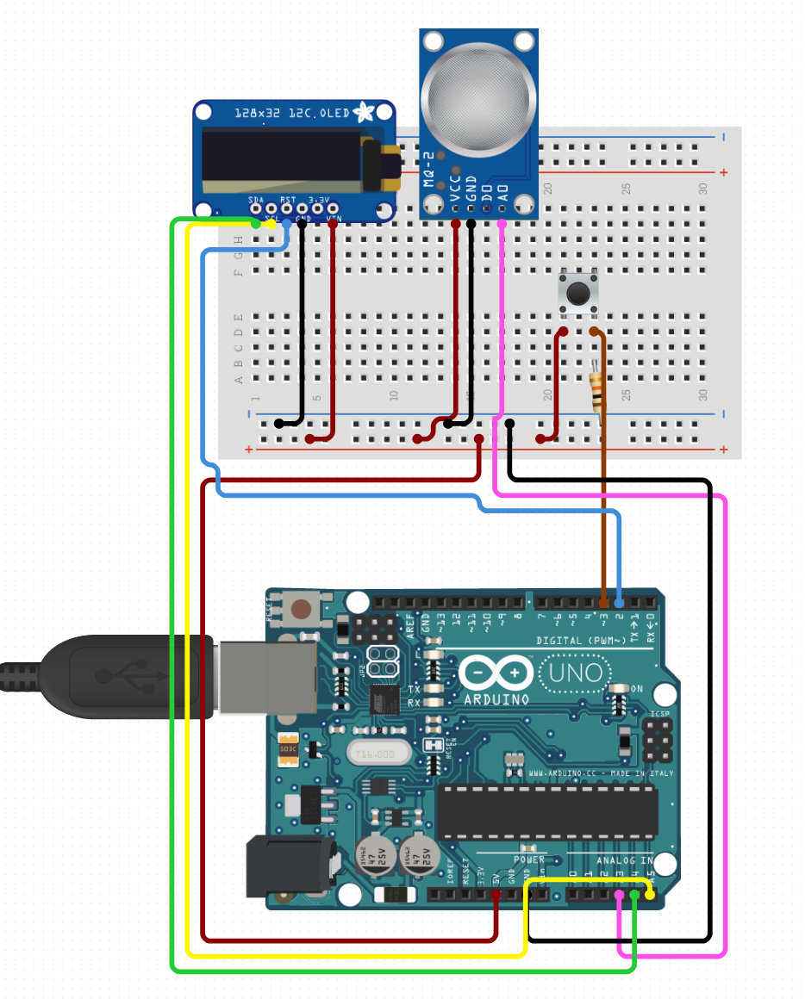

# Arduino Smoke Detector

### This is my attempt at creating a highly cost effective joint CO/Smoke/LPG detector & alarm.

---

## Parts:

| Part | Cost (Item, Tax, & Shipping) | Necessary |
|------|------|------|
| Arduino Uno | **$4.27** | **Yes** |
| MQ-2 Gas Sensor | **$1.43** | **Yes** |
| 0.91" 128x32 pixel i2c OLED | $4.10 | No |
| 400-tie Breadboard (already owned) | $1.00? | No |
| Momentary push button (already owned) | $0.05? | No 
| Arduino Uno case | $3.22 | No |
| Piezo Buzzer | **$1.73** | **Yes** |

Out of all the parts planned to be used, only the Arduino board, MQ-2 sensor, and buzzer are necessary, for a total of $7.43. Those are non-bulk prices and with slightly upgraded shipping; if you were to purchase the items in lots of 5 and were more patient than I, you could cut down the cost to somewhere in the ballpark of $5 each. 

For accessibility reasons, one could also try substituting lights (neopixels for flashing colors, or maybe COB LEDs for brightness) or vibrating motors for the buzzers, or a myriad of other possible sensors to provide other external stimuli.

---

## Demo:

---

## Schematics

Current Schematic, made through www.circuito.io and whose direct URL can be found commented in smoke_detector.ino.

